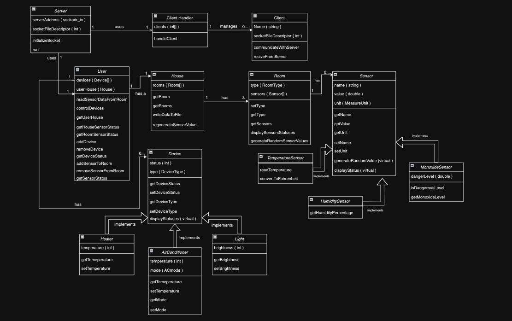
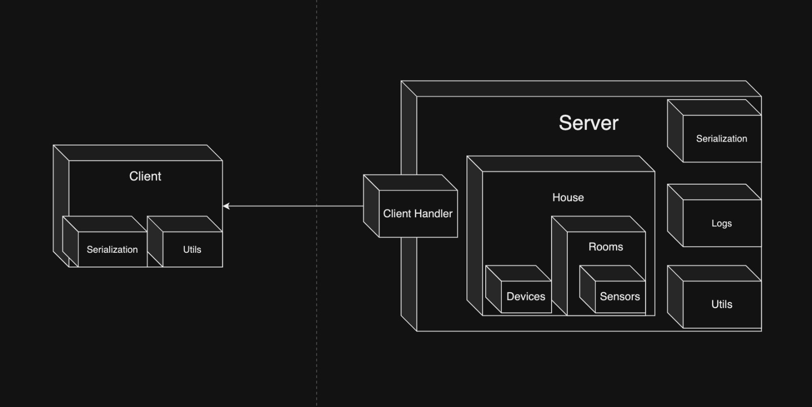
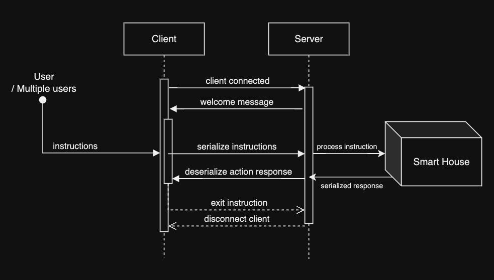
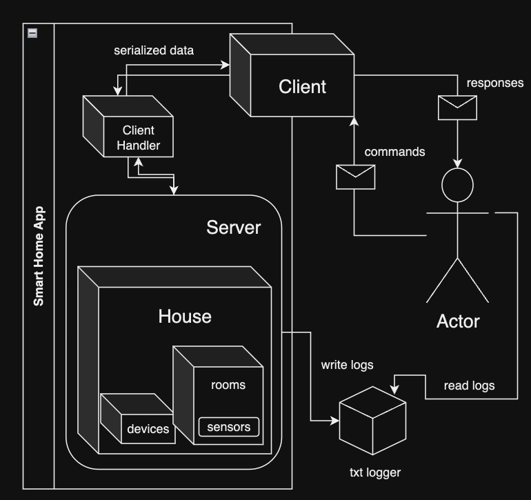

# Nagarro Remote Learning | Design patterns analysis

1. ### **<u>Singleton</u> Pattern** (Creational):
  - **Why**: The system only needs one instance of the Server or House class to manage the state and operations of the smart home. Using a Singleton ensures that there's only one global point of access to this instance.
  - **How**: Implement a Singleton pattern for the Server class. This will control the instantiation process, making sure that only one Server object manages the communication and data processing.

2. ### **<u>Factory Method</u> Pattern** (Creational):
  - **Why**: We do have various sensor types like `TemperatureSensor`, `HumiditySensor`, and `MonoxideSensor`. To facilitate the creation of these objects without specifying the exact class of object that will be created, a Factory Method can be useful.
  - **How**: Create a `SensorFactory` class with a method `createSensor`, which returns a `Sensor` object. Depending on the parameters, it will instantiate the appropriate subclass.

3. ### **<u>Observer</u> Pattern** (Behavioral):
  - **Why**: If we need to keep multiple clients updated with changes to the state of the house (like sensor readings or device statuses), the Observer pattern is a good choice. It allows for a publish-subscribe model where clients can subscribe to updates and be notified asynchronously.
  - **How**: Implement the Observer pattern where the `Sensor` and `Device` classes act as subjects, and the `Client` acts as an observer. Whenever a sensor value changes, the subscribed clients get notified.

4.  ### **<u>Command</u> Pattern** (Behavioral):
   - **Why**: Commands are sent from the Client to the Server. To encapsulate these requests, we can use the Command pattern. This will give us the ability to parameterize objects with operations, queue or log requests, and support undoable operations.
   - **How**: Implement a `Command` interface with an `execute()` method and concrete command classes for different operations (like `AdjustTemperatureCommand`). The `Client` creates a command object and sends it to the `Server` to execute.

5. ### **<u>Adapter</u> Pattern** (Structural):
  - **Why**: If the smart home system needs to interact with third-party libraries or systems that have incompatible interfaces, an Adapter can be used to bridge the gap without changing the existing system code.
  - **How**: Implement an `ExternalSystemAdapter` class that translates the interface of the external system into one that the smart home system can understand and use.

## Diagrams
### Class Diagram
  
### Package Diagram
  
### Sequence Diagram
  
### Use Case Diagram 
  